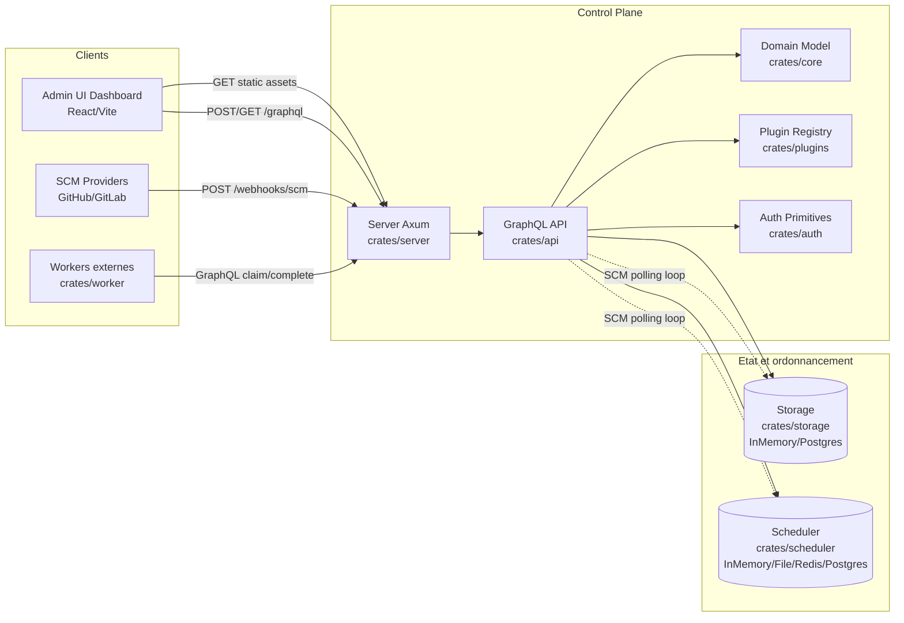
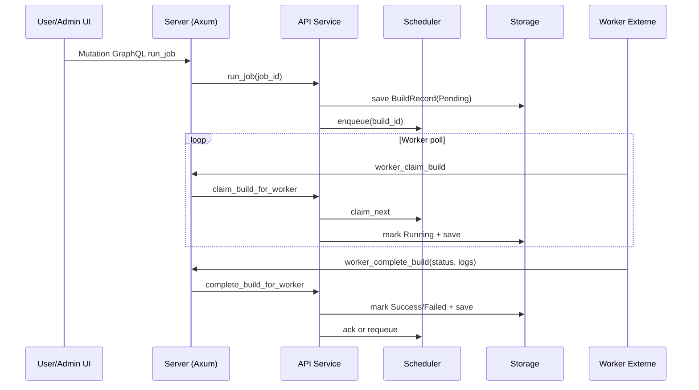
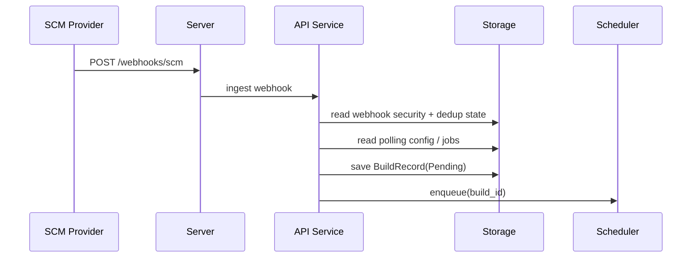
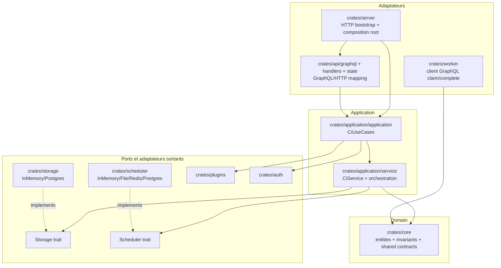

# Architecture du projet Tardigrade CI

Ce document donne une vue d ensemble de l architecture actuelle du projet.

## Vue globale (containers + flux)

## Flux operationnels

### 1. Build standard

### 2. Trigger SCM

## Cartographie des crates

- `crates/server`: bootstrap runtime Axum, montage routes GraphQL et webhook SCM, assets dashboard.
- `crates/api`: schema GraphQL, etat partage et mapping adaptateur entrant (HTTP/GraphQL).
- `crates/application`: use-cases CI et orchestration metier transport-neutre.
- `crates/core`: modele metier (jobs, builds, pipeline DSL, SCM config, technology profiles).
- `crates/storage`: persistence abstraite + implementations InMemory et Postgres.
- `crates/scheduler`: file de builds + backends InMemory, File, Redis, Postgres.
- `crates/worker`: worker externe qui claim/complete les builds via GraphQL.
- `crates/plugins`: contrat et registre plugins (lifecycle + permissions).
- `crates/auth`: primitives d authentification.

## Principes d architecture

- Control-plane GraphQL-only pour les operations CI.
- Entree webhook SCM native separee (`/webhooks/scm`).
- Separation nette entre orchestration API, persistence (storage), et ordonnancement (scheduler).
- Execution de build externalisee via workers dedies (pas de mode embedded).
- Backends remplacables via traits et selection runtime par configuration.

## Convergence hexagonale pragmatique (HEXA-05)

Cette section fixe le graphe cible de dependances pour la phase pragmatique.
Objectif: clarifier les frontieres d architecture sans casser la surface runtime actuelle.

### Graphe cible de dependances (phase pragmatique)

### Regles de dependance (phase pragmatique)

- Regle 1: les adaptateurs entrants (`server`, `graphql`, `handlers`, `state`) appellent la couche use-case (`application`) et ne contiennent pas d orchestration metier longue.
- Regle 2: la couche application (`crates/application`) depend du domaine (`core`) et des ports (`Storage`, `Scheduler`), jamais d un backend concret.
- Regle 3: les backends concrets (`storage`, `scheduler`) sont choisis au bootstrap (`server`) et passes sous forme de trait objects.
- Regle 4: `worker` consomme des contrats neutres depuis `core` pour les DTO partages; tout couplage restant a `api` doit etre explicite et confine.

### Regles interdites (phase pragmatique)

- Interdit: `core` depend de `api`, `server`, `storage`, `scheduler`, `worker`.
- Interdit: les modules adaptateurs GraphQL/HTTP importent directement des types de backend Postgres/Redis/File.
- Interdit: la logique metier de workflow CI est dupliquee dans `server`, `graphql`, `handlers` ou `worker`.

### Ecarts restants assumes (avant phase stricte)

- Les operations plugin/policy sont partiellement portees par `ApiState` et seront alignees progressivement via la couche use-case.
- Le binaire de benchmark worker peut encore activer un couplage API derriere feature gate (`transport-bench`).
