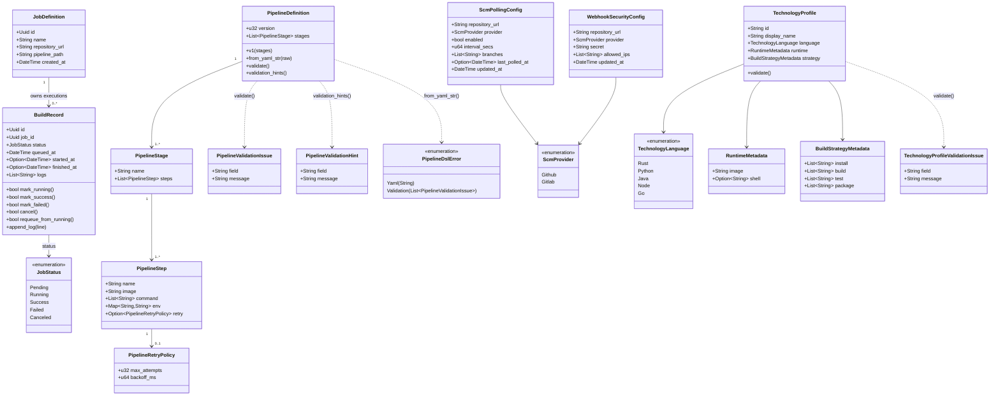
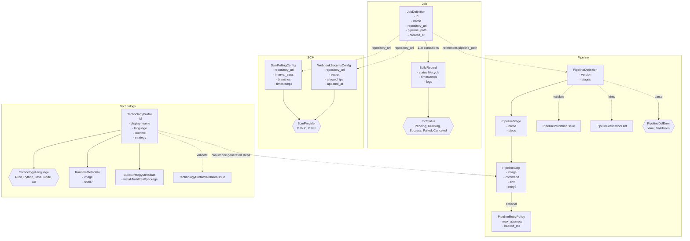

# Tardigrade Core - Diagrammes du modele objet

Ce document decrit le modele objet de la crate core.

## 1) Diagramme UML (classDiagram)

```mermaid
classDiagram
direction TB

class JobDefinition {
  +Uuid id
  +String name
  +String repository_url
  +String pipeline_path
  +DateTime created_at
}

class BuildRecord {
  +Uuid id
  +Uuid job_id
  +JobStatus status
  +DateTime queued_at
  +Option~DateTime~ started_at
  +Option~DateTime~ finished_at
  +List~String~ logs
  +bool mark_running()
  +bool mark_success()
  +bool mark_failed()
  +bool cancel()
  +bool requeue_from_running()
  +append_log(line)
}

class JobStatus {
  <<enumeration>>
  Pending
  Running
  Success
  Failed
  Canceled
}

JobDefinition "1" --> "0..*" BuildRecord : owns executions
BuildRecord --> JobStatus : status

class PipelineDefinition {
  +u32 version
  +List~PipelineStage~ stages
  +v1(stages)
  +from_yaml_str(raw)
  +validate()
  +validation_hints()
}

class PipelineStage {
  +String name
  +List~PipelineStep~ steps
}

class PipelineStep {
  +String name
  +String image
  +List~String~ command
  +Map~String,String~ env
  +Option~PipelineRetryPolicy~ retry
}

class PipelineRetryPolicy {
  +u32 max_attempts
  +u64 backoff_ms
}

class PipelineValidationIssue {
  +String field
  +String message
}

class PipelineValidationHint {
  +String field
  +String message
}

class PipelineDslError {
  <<enumeration>>
  Yaml(String)
  Validation(List~PipelineValidationIssue~)
}

PipelineDefinition "1" --> "1..*" PipelineStage
PipelineStage "1" --> "1..*" PipelineStep
PipelineStep "1" --> "0..1" PipelineRetryPolicy
PipelineDefinition ..> PipelineValidationIssue : validate()
PipelineDefinition ..> PipelineValidationHint : validation_hints()
PipelineDefinition ..> PipelineDslError : from_yaml_str()

class ScmProvider {
  <<enumeration>>
  Github
  Gitlab
}

class ScmPollingConfig {
  +String repository_url
  +ScmProvider provider
  +bool enabled
  +u64 interval_secs
  +List~String~ branches
  +Option~DateTime~ last_polled_at
  +DateTime updated_at
}

class WebhookSecurityConfig {
  +String repository_url
  +ScmProvider provider
  +String secret
  +List~String~ allowed_ips
  +DateTime updated_at
}

ScmPollingConfig --> ScmProvider
WebhookSecurityConfig --> ScmProvider

class TechnologyProfile {
  +String id
  +String display_name
  +TechnologyLanguage language
  +RuntimeMetadata runtime
  +BuildStrategyMetadata strategy
  +validate()
}

class TechnologyLanguage {
  <<enumeration>>
  Rust
  Python
  Java
  Node
  Go
}

class RuntimeMetadata {
  +String image
  +Option~String~ shell
}

class BuildStrategyMetadata {
  +List~String~ install
  +List~String~ build
  +List~String~ test
  +List~String~ package
}

class TechnologyProfileValidationIssue {
  +String field
  +String message
}

TechnologyProfile --> TechnologyLanguage
TechnologyProfile --> RuntimeMetadata
TechnologyProfile --> BuildStrategyMetadata
TechnologyProfile ..> TechnologyProfileValidationIssue : validate()
```

## 2) Diagramme de flux domaine (flowchart)

```mermaid
flowchart TB
  subgraph JOB[Job]
    JD[JobDefinition\n- id\n- name\n- repository_url\n- pipeline_path\n- created_at]
    BR[BuildRecord\n- status lifecycle\n- timestamps\n- logs]
    JS{{JobStatus\nPending, Running, Success, Failed, Canceled}}
    JD -->|1..n executions| BR
    BR --> JS
  end

  subgraph PIPELINE[Pipeline]
    PD[PipelineDefinition\n- version\n- stages]
    PS[PipelineStage\n- name\n- steps]
    PST[PipelineStep\n- image\n- command\n- env\n- retry?]
    PRP[PipelineRetryPolicy\n- max_attempts\n- backoff_ms]
    PVI[PipelineValidationIssue]
    PVH[PipelineValidationHint]
    PDE{{PipelineDslError\nYaml, Validation}}

    PD --> PS
    PS --> PST
    PST -->|optional| PRP
    PD -. validate .-> PVI
    PD -. hints .-> PVH
    PD -. parse .-> PDE
  end

  subgraph SCM[SCM]
    SP{{ScmProvider\nGithub, Gitlab}}
    SPC[ScmPollingConfig\n- repository_url\n- interval_secs\n- branches\n- timestamps]
    WSC[WebhookSecurityConfig\n- repository_url\n- secret\n- allowed_ips\n- updated_at]

    SPC --> SP
    WSC --> SP
  end

  subgraph TECH[Technology]
    TP[TechnologyProfile\n- id\n- display_name\n- language\n- runtime\n- strategy]
    TL{{TechnologyLanguage\nRust, Python, Java, Node, Go}}
    RM[RuntimeMetadata\n- image\n- shell?]
    BSM[BuildStrategyMetadata\n- install/build/test/package]
    TPV[TechnologyProfileValidationIssue]

    TP --> TL
    TP --> RM
    TP --> BSM
    TP -. validate .-> TPV
  end

  JD -. references pipeline_path .-> PD
  JD -. repository_url .-> SPC
  JD -. repository_url .-> WSC
  TP -. can inspire generated steps .-> PST
```
